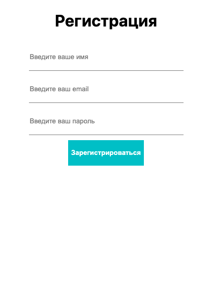
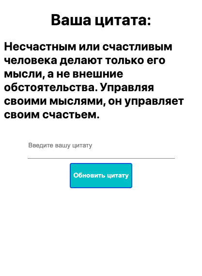

# Base sing in app
=======
 > Base sign in application use mern stack Mongodb, Express, React, Nodejs
 > * after registation and login we'll be able to recived simple page with quotes and feature to edit and save that 

> server command 
>  for start express server and connection to mongodb /npm run serve
> ***
> client command 
> run react app  /npm start
